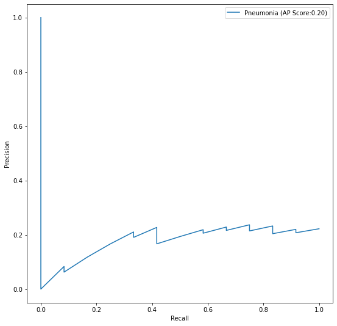

# FDA  Submission

**Your Name:**
Joshua Shabo

**Name of your Device:**
Pneumonia Diagnosis Assistant

## Algorithm Description 

### 1. General Information

**Intended Use Statement:** 
This AI model is intended to be used in a clinic to assist a radiologist in identifying the presense or absense of certain respiratory diseases.

**Indications for Use:**
- The model is only meant to be used to help give a second opinion, not for primary diagnoses. 
- The target population are: any age from 10 - 90 across all genders

**Device Limitations:**
- The model's training focus was on the presence and absence of Penumonia. Hence, it's not suitable for use to classify other types diseases.
- The model works best on a GPU-powered infrastructure, and might be too slow on CPU-powered ones.

**Clinical Impact of Performance:**
As this AI is not meant to be used as the main diagnosis for a patient, the AI should only assist the radiologist who will give their final opinion, hence reducing the chance of impact of false positive or false negative 

### 2. Algorithm Design and Function
```
    +-------+
    | Start |
    +-------+
       |
+------------------+
| Select DICOM and |
| load Image       |
+------------------+
       |
+------------------+
| Validate DICOM   |
| Image            |
+------------------+
       |
   +-------+
   | Valid?|
   +-------+
    /     \
   /       \
Yes        No
 |          \
 |           \
 |            +------[End]
 |             
+------------------+ 
| Preprocess DICOM |
| Image            |
+------------------+
       |
+------------------+
| Input Image to   |
| AI Model         |
+------------------+
       |
+------------------+
| Classify Image   |
+------------------+
       |
+------------------+
| Display Result   |
+------------------+
       |
    +-----+
    | End |
    +-----+
```

**DICOM Checking Steps:**
The algorithm will work after the following validations pass

- patient's age is > 10 and < 90
- patient's position is 'PA' or 'AP'
- the exampied body part is 'CHEST'
- that modality is 'DX'

**Preprocessing Steps:**

**CNN Architecture:**
This classifier is based on VGG16 architecture, with 17 early layers frozen and using weights from block5_pool 

### 3. Algorithm Training

**Parameters:**
* Types of augmentation used during training
    - rescale: 1./255.0
    - horizontal_flip: True
    - vertical_flip: False
    - rotation_range: 20
    - width_shift_range: 0.1
    - height_shift_range: 0.1
    - shear_range: 0.1
    - zoom_range: 0.1

* Batch size: 32
* Optimizer learning rate: 1e-4
* Layers of pre-existing architecture that were frozen:
    - input_1 False
    - block1_conv1 
    - block1_conv2 
    - block1_pool 
    - block2_conv1 
    - block2_conv2 
    - block2_pool 
    - block3_conv1 
    - block3_conv2 
    - block3_conv3 
    - block3_pool 
    - block4_conv1 
    - block4_conv2 
    - block4_conv3 
    - block4_pool 
    - block5_conv1 
    - block5_conv2 

* Layers of pre-existing architecture that were fine-tuned:
    - block5_conv3 
    - block5_pool 

* Layers added to pre-existing architecture:
- Dropout: 0.3
- Dense: 1024, relu
- Dropout: 0.3
- Dense: 512, relu
- Dropout: 0.3
- Dense: 256, relu
- Dropout: 0.3
- Dense: 1, sigmoid





**Final Threshold and Explanation:**

The threshold was chosen to be 0.54 which seems to give the best balance between precision and recall. The recall was 0.55 and the precision was 0.625

Precision is: 0.625
Recall is: 0.5555555555555556
Threshold is: 0.5456092
F1 Score is: 0.5882352941176471

### 4. Databases

**Description of Training Dataset:** 

The training dataset is composed of 2290 Chest X-ray images with a ratio of 50/50% for positive and negative cases.

**Description of Validation Dataset:** 

The validation dataset is composed of 1430 Chest X-ray images with a ratio of 20/80% for positive (Pneumonia cases) and negative.


### 5. Ground Truth

The ground truth was derived from the NIH X-ray dataset, utilizing Natural Language Processing (NLP) to mine associated radiological reports. The dataset is imbalanced, with multiple labels often identified for each instance, reflecting a variety of conditions including Pneumonia, Atelectasis, Consolidation, Infiltration, and ten others.

### 6. FDA Validation Plan

**Patient Population Description for FDA Validation Dataset:**

For the validation plan, we recommend the following to be considered for the FDA validation dataset:
- Age range: between 10 - 90
- All genders
- Modality: DX
- Body part: CHEST
- A 20/80% ratio of positive/negative cases of Pneumonia vs other diseases or No Finding

**Ground Truth Acquisition Methodology:**

To achieve optimal ground truth, a multi-faceted approach would be implemented. 
The primary focus would be on acquiring well-annotated and verified datasets where pneumonia diagnoses have been confirmed through clinical, radiological, and microbiological evaluations, with emphasis on clinical correlation. The acquired data would undergo rigorous quality checks to ensure the accuracy of labels. Additionally, expert radiologists would review ambiguous or unclear cases to finalize the annotations, ensuring a high level of consensus and minimizing label errors. The process aims to establish a robust and reliable ground truth, reflecting real-world clinical scenarios and ensuring the relevance and applicability of the model.

**Algorithm Performance Standard:**

The performance standard would be anchored to the benchmark set by the "CheXNet: Radiologist-Level Pneumonia Detection on Chest X-Rays with Deep Learning" study. In accordance with this study, the model should aspire to achieve or surpass radiologist-level performance on pneumonia detection tasks. Specifically, the model should target a high area under the Receiver Operating Characteristic curve (AUROC) and aim for optimal balance between sensitivity and specificity, ensuring minimal false negatives and false positives. This standard provides a rigorous and clinically relevant benchmark, ensuring the model’s efficacy and reliability in detecting pneumonia in diverse and challenging scenarios.


